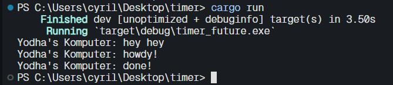

<b> 1.2 Understanding How It Work's </b>

Berdasarkan output tersebut terlihat bahwa hey hey dicetak terlebih dahulu walaupun kode untuk mencetal hey hey berada di bawah kode untuk mencetak howdy! dan done. Hal ini terjadi karena kode untuk mencetak howdy! dan done berjalan secara asinkronus sehingga memungkinkan program untuk mencetak hey hey terlebih dahulu

