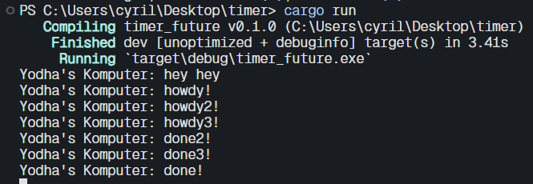

<b> 1.2 Understanding How It Work's </b>

Berdasarkan output tersebut terlihat bahwa hey hey dicetak terlebih dahulu walaupun kode untuk mencetal hey hey berada di bawah kode untuk mencetak howdy! dan done. Hal ini terjadi karena kode untuk mencetak howdy! dan done berjalan secara asinkronus sehingga memungkinkan program untuk mencetak hey hey terlebih dahulu

<b> 1.3 Multiple Spawn</b>

Dari output tersebut terlihat howdy akan dicetak terlebih dahulu baru kemudia done dicetak, pada output tersebut juga terlihat program tetap berjalan walaupun sudah mencetak seluruh string, hal ini terjadi karena kita menghapus kode `drop(spwaner)` sehingga executor tidak akan tahu jika data sudah diproses semua oleh spawner.
